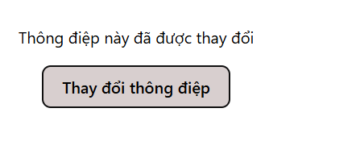
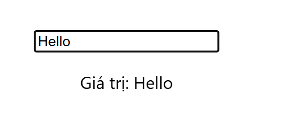
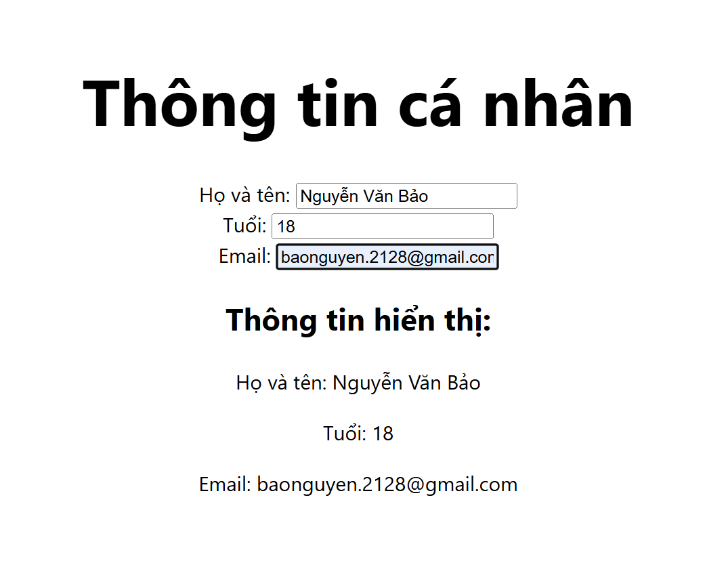
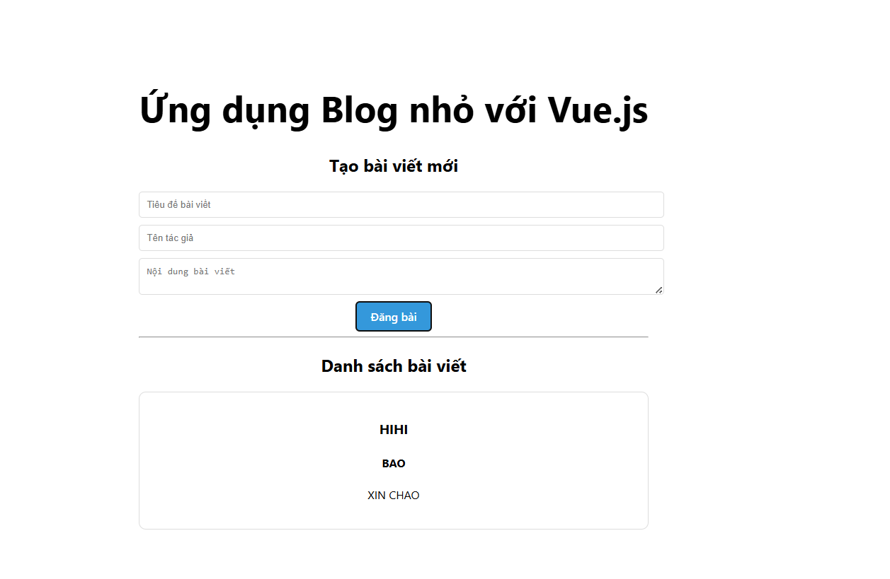

<!-- # Vue 3 + Vite

This template should help get you started developing with Vue 3 in Vite. The template uses Vue 3 `<script setup>` SFCs, check out the [script setup docs](https://v3.vuejs.org/api/sfc-script-setup.html#sfc-script-setup) to learn more.

Learn more about IDE Support for Vue in the [Vue Docs Scaling up Guide](https://vuejs.org/guide/scaling-up/tooling.html#ide-support). -->

# Bài 1: Demo Lab 5

### 1. Giao diện ban đầu

### 2. Giao diện sau khi tương tác

# Bài 2: Two-way Binding với v-model
### 1. Giao diện nhập liệu

### 2. Kết quả Binding thời gian thực

# Bài 3: Form Thông tin cá nhân (Reactivity)
### 1. Giao diện Form và Kết quả hiển thị

# Bài 4: Ứng dụng Blog cá nhân (Props & Events)
### 1. Giao diện tổng quan ứng dụng

