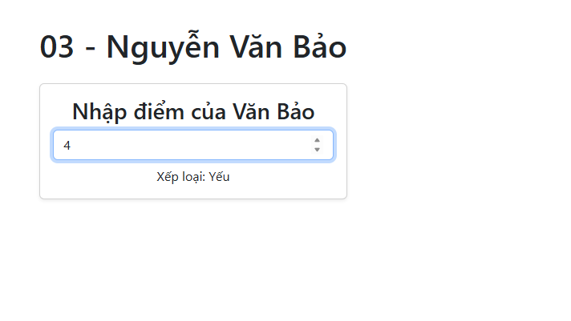
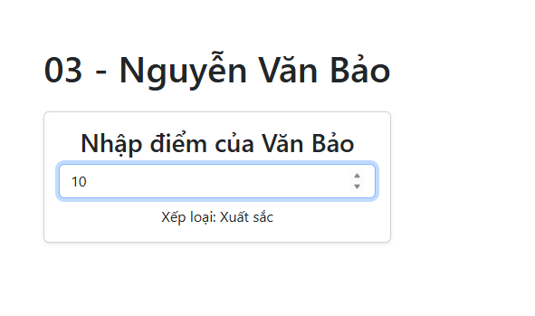
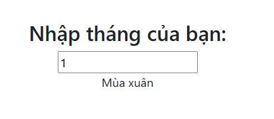
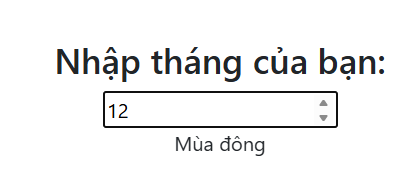
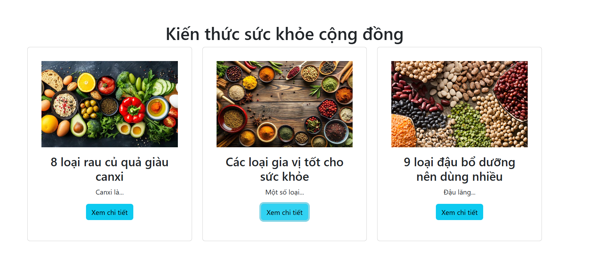
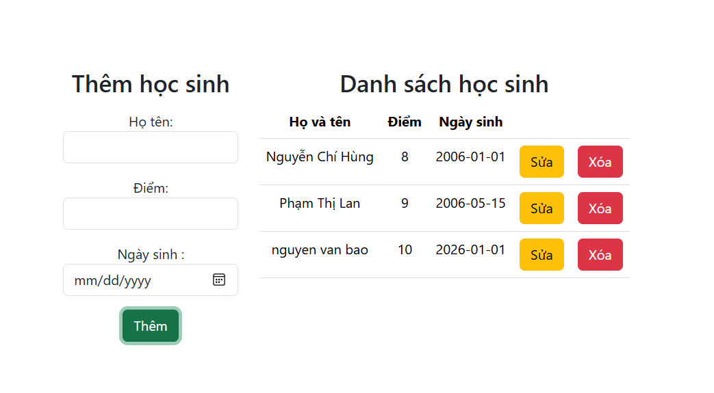

<!-- # Vue 3 + Vite

This template should help get you started developing with Vue 3 in Vite. The template uses Vue 3 `<script setup>` SFCs, check out the [script setup docs](https://v3.vuejs.org/api/sfc-script-setup.html#sfc-script-setup) to learn more.

Learn more about IDE Support for Vue in the [Vue Docs Scaling up Guide](https://vuejs.org/guide/scaling-up/tooling.html#ide-support). -->

# Lab 6: Conditional Rendering & List Rendering

Bài thực hành tập trung vào việc xử lý điều kiện (`v-if`, `v-else`) và vòng lặp danh sách (`v-for`) trong VueJS.

---

## Bài 1: Xếp loại học lực (Conditional Rendering)
[cite_start]**Yêu cầu:** Nhập điểm trung bình và sử dụng `v-if/v-else-if` để in ra xếp loại (Yếu, Trung bình, Khá, Giỏi, Xuất sắc)[cite: 284].

### 1. Giao diện nhập điểm

### 2. Kết quả xếp loại

---

## Bài 2: Xác định mùa trong năm
**Yêu cầu:** Nhập tháng (1-12) để xác định mùa tương ứng. [cite_start]Hiển thị thông báo lỗi nếu nhập sai tháng[cite: 294].

### 1. Giao diện nhập tháng

### 2. Kết quả hiển thị mùa

---

## Bài 3: Danh sách bài viết (List Rendering)
[cite_start]**Yêu cầu:** Sử dụng `v-for` để hiển thị danh sách các bài viết kiến thức sức khỏe (Hình ảnh, Tiêu đề, Nội dung) thay vì code cứng từng thẻ[cite: 328].

### 1. Hiển thị danh sách dạng lưới (Grid)

---

## Bài 4: Quản lý học sinh (CRUD)
[cite_start]**Yêu cầu:** Xây dựng ứng dụng quản lý học sinh với các chức năng: Thêm mới, Xem danh sách, Sửa thông tin và Xóa học sinh.

### 1. Giao diện quản lý toàn diện
