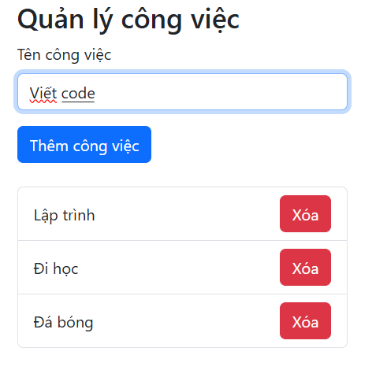
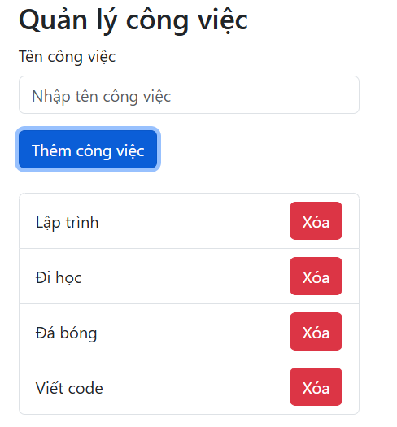
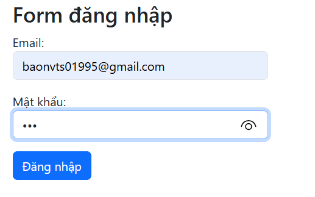
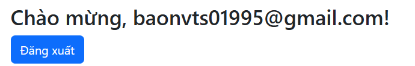
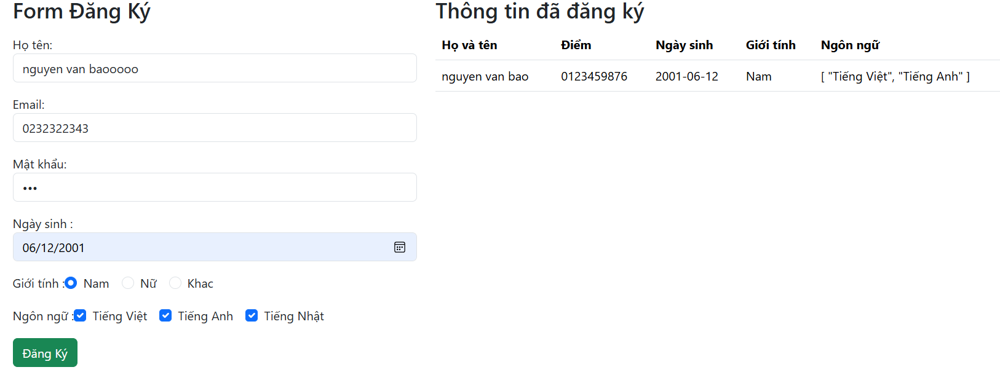
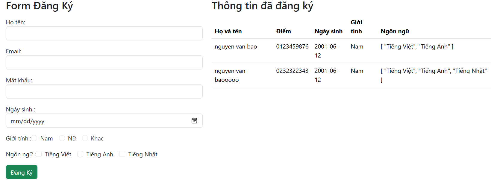
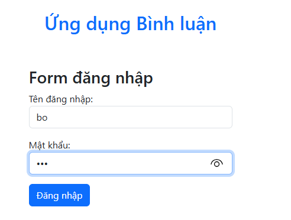
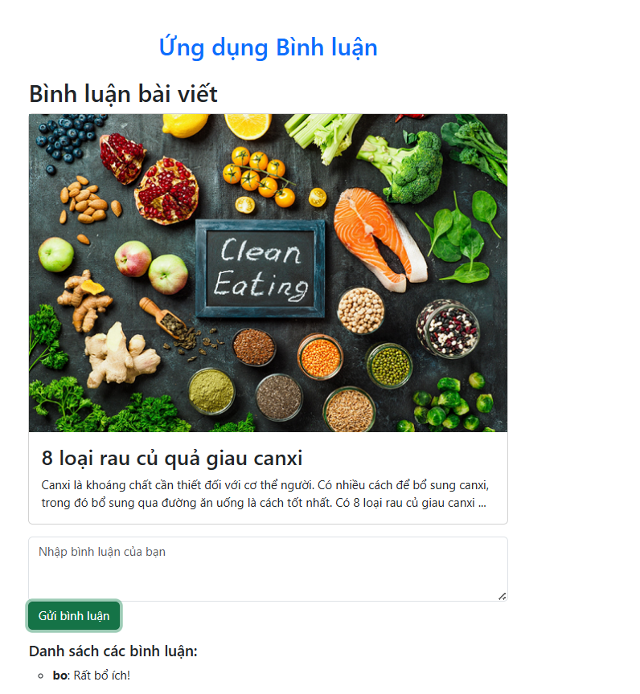

# 03 - TS01995 - Nguyễn Văn Bảo

 Lab 7 thuộc môn **Xây dựng giao diện tương tác (Vue.js)**. Dự án này tập trung vào việc xử lý sự kiện (Event Handling), ràng buộc dữ liệu 2 chiều (Form Binding) và cơ chế giao tiếp giữa các Component trong Vue 3 (Composition API).

### 📝 Bài 1: Quản lý công việc (To-do List)
- **File:** `Bai1.vue`
- **Mô tả:** Ứng dụng quản lý danh sách công việc cơ bản.

- **Tính năng nổi bật:**
  - Ngăn chặn hành vi reload trang mặc định của form bằng `@submit.prevent`.
  - Thêm và Xóa công việc khỏi danh sách.
  - Sử dụng Bootstrap Flexbox (`d-flex justify-content-between`) để căn chỉnh UI.
  - **Nâng cao:** Tích hợp `localStorage` để lưu trữ danh sách công việc vĩnh viễn không bị mất khi tải lại trang.
  

### 🔐 Bài 2: Form Đăng nhập & Validation
- **File:** `Bai2.vue`
- **Mô tả:** Form đăng nhập tài khoản có tích hợp kiểm tra dữ liệu đầu vào.

- **Tính năng nổi bật:**
  - Sử dụng Regular Expression (Regex) để kiểm tra định dạng Email chuẩn.
  - Hiển thị thông báo lỗi bằng `v-if` khi người dùng bỏ trống hoặc nhập sai định dạng.
  - Xử lý chuyển đổi giao diện (Đăng nhập / Chào mừng) mượt mà dựa trên trạng thái `isLoggedIn`.

### 📋 Bài 3: Form Đăng ký (Form Binding toàn diện)
- **File:** `Bai3.vue`
- **Mô tả:** Ứng dụng thu thập thông tin người dùng và hiển thị ra bảng dữ liệu.

- **Tính năng nổi bật:**
  - Thực hành `v-model` với đa dạng kiểu dữ liệu: `String` (Họ tên, Email, Giới tính) và `Array` (Ngôn ngữ lập trình).
  - Xử lý mảng (Array) linh hoạt khi tick chọn/bỏ chọn Checkbox nhiều đáp án.
  - Tách mảng dữ liệu sinh viên `students` để lưu trữ nhiều người dùng và in ra Table Bootstrap.

### 💬 Bài 4: Ứng dụng Bình luận (Component Communication)
- **Files:** `Bai4.vue` (Login), `Bai4a.vue` (Comment), `Bai4b.vue` (Main Dashboard)
- **Mô tả:** Ứng dụng thu nhỏ kết hợp việc đăng nhập và bình luận bài viết, chia nhỏ thành các Component riêng biệt.

- **Tính năng nổi bật:**
  - **Component Cha (`Bai4b.vue`):** Đóng vai trò Controller quản lý trạng thái hiển thị.
  - **`defineEmits`:** Component Login (`Bai4`) tự động phát sự kiện báo cáo lên Cha khi đăng nhập thành công kèm theo Tên người dùng.
  - **`defineProps`:** Component Comment (`Bai4a`) nhận dữ liệu Tên người dùng từ Cha truyền xuống để hiển thị tên người bình luận.
  

---

