# 03 - TS01995 - Nguyễn Văn Bảo

# 🚀 Lab 8: Điều hướng ứng dụng với Vue Router (MyBlog App)

Bài thực hành Lab 8 thuộc môn **Xây dựng giao diện tương tác (Vue.js)** . Lab này tập trung vào việc triển khai và quản lý hệ thống điều hướng trang (Routing).

### 🏠 1. Trang chủ & Danh sách Blog (`BlogPage.vue` & `PostList.vue`)
- **Mô tả:** Trang hiển thị danh sách các bài viết du lịch/ẩm thực. Cấu hình trang mặc định mở lên đầu tiên (Path: `/`).
- **Tính năng:**
  - Lọc bài viết theo danh mục (Sử dụng Query URL).
  - Điều hướng bằng `<router-link>` linh hoạt trên Navbar.

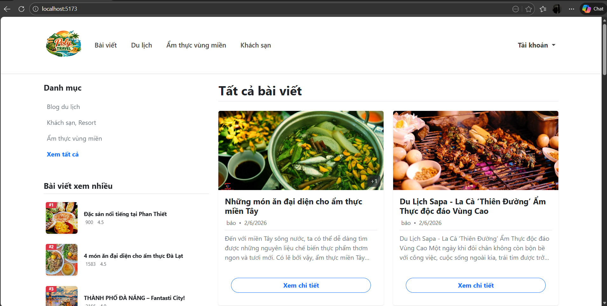

---

### 📖 2. Trang Chi tiết Bài viết (`PostDetail.vue`)
- **Mô tả:** Trang hiển thị nội dung chi tiết của một bài viết cụ thể dựa vào ID.
- **Tính năng (Dynamic Route):**
  - Bắt tham số động trên URL thông qua `this.$route.params.id`.
  - Hiển thị bài viết tương ứng và cho phép thêm Bình luận (được lưu vào LocalStorage).
  - Điều hướng lập trình: Nút "Quay lại trang chủ" sử dụng `$router.push('/')`.

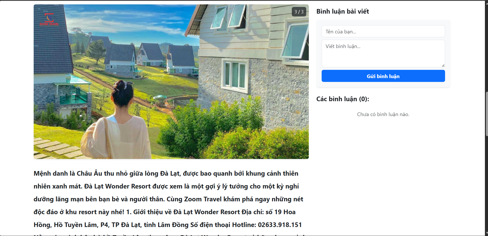

---

### 🔐 3. Trang Đăng nhập & Đăng ký (`Login.vue` & `Register.vue`)
- **Mô tả:** Nơi người dùng xác thực tài khoản.
- **Tính năng (Programmatic Navigation):**
  - Kiểm tra tài khoản tồn tại trong LocalStorage.
  - Khi đăng nhập thành công, sử dụng `this.$router.push({ name: 'admin' })` để tự động đẩy người dùng (nếu là Admin) sang trang Quản trị, hoặc trang chủ (nếu là User thường).

- Form Đăng Ký
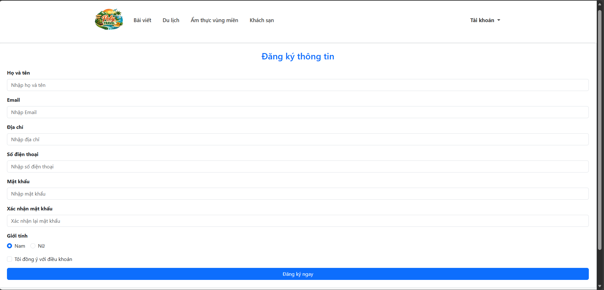

-Form Đăng Nhập
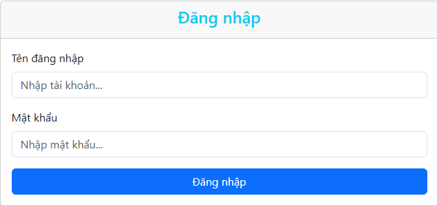

---

### ⚙️ 4. Trang Bảng điều khiển Quản trị (`AdminDashboard.vue`)
- **Mô tả:** Khu vực dành riêng cho Admin để thêm/sửa/xóa bài viết và quản lý người dùng.
- **Tính năng (Route Guard):**
  - Trang này được gắn meta `requiresAuth: true`.
  - Router sẽ tự động kiểm tra, nếu không tìm thấy `currentUser` trong LocalStorage, người dùng sẽ bị đá văng về trang `/login`.

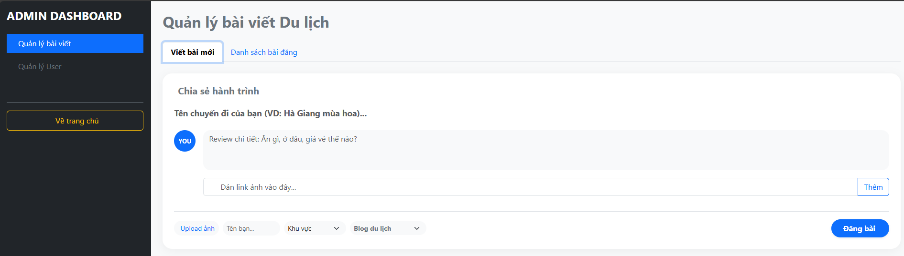
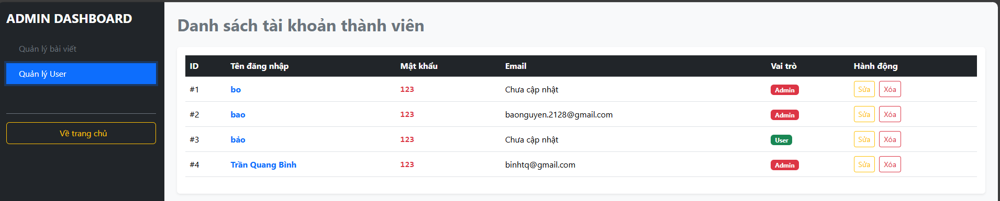

---

### 👤 5. Trang Thông tin Cá nhân (`UserProfile.vue`)
- **Mô tả:** Nơi người dùng xem và cập nhật thông tin tài khoản.
- **Tính năng (Nested Routes & Alias):**
  - Hỗ trợ bí danh URL: Gõ `/me` hay `/profile` đều truy cập được vào trang này.
  - Tích hợp `<router-view>` phụ bên trong Component để render 2 trang con:
    1. Thông tin cơ bản (`/profile/info`)
    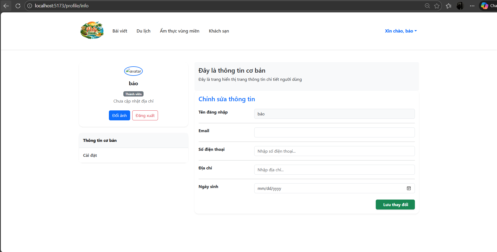
    2. Cài đặt tài khoản (`/profile/settings`)
    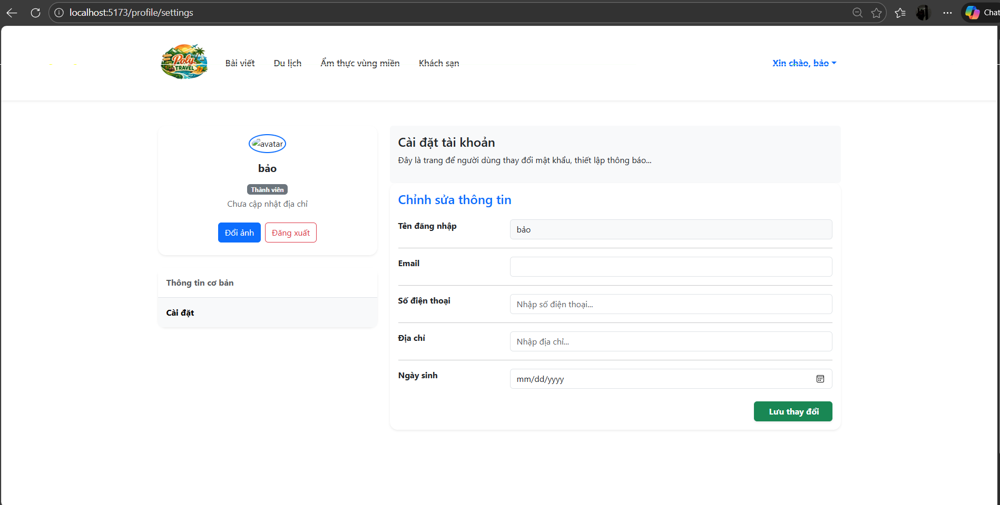

###  6. Cấu hình Định tuyến (`router/index.js`)
- **Mô tả:** Nơi tập hợp toàn bộ logic xử lý Route mà Lab 8 yêu cầu.
- **Kỹ thuật áp dụng trong code:**
  - Khai báo mảng `routes` với đầy đủ các thuộc tính `path`, `name`, `component`.
  - Cấu hình **Nested Routes** (`children`) và **Alias** (`/me`) cho trang Profile.
  - Thiết lập thuộc tính `meta: { requiresAuth: true }` để đánh dấu trang Admin cần bảo vệ.
  - Triển khai hàm **Global Navigation Guard** (`router.beforeEach`) để kiểm tra quyền truy cập thông qua LocalStorage trước khi cho phép chuyển trang.

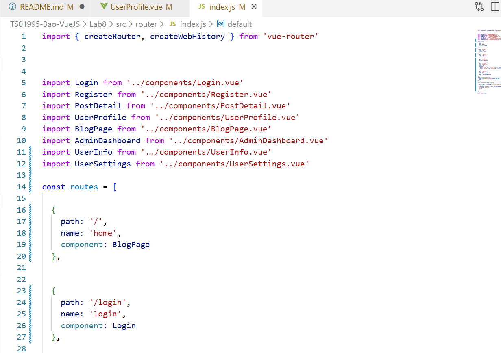
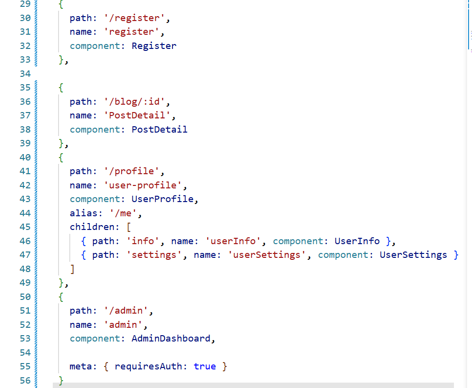
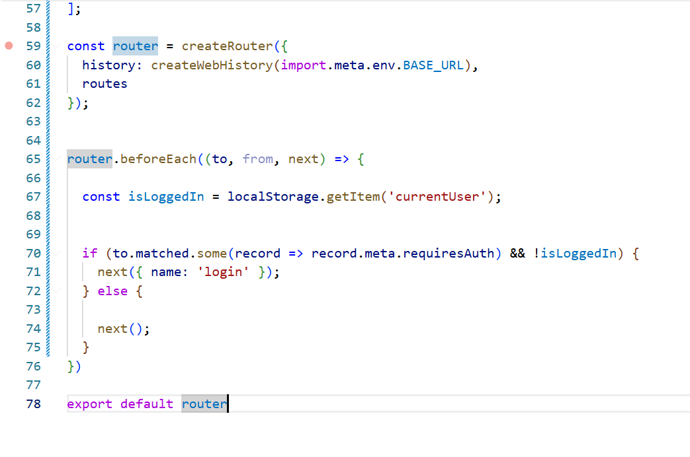

---
